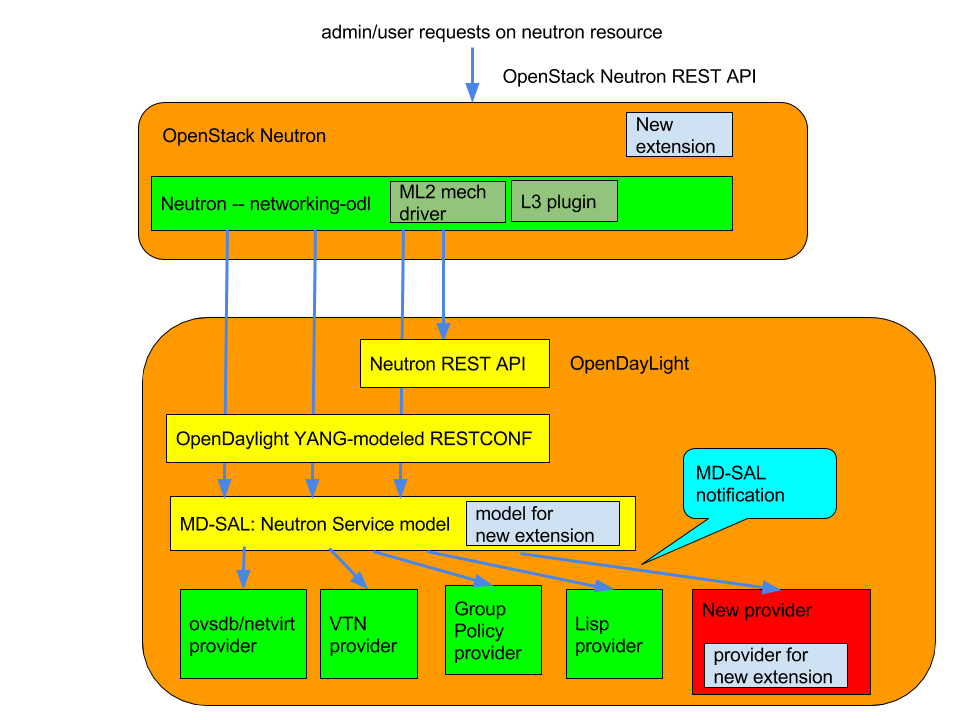

# OpenDaylight

## Introduction
OpenDaylight is the most popular opensource SDN controller.

ODL employs a model-driven approach to describe the network, the functions to be performed on it and the resulting state or status achieved.

By sharing YANG data structures in a common data store and messaging infrastructure, OpenDaylight allows for fine-grained services to be created then combined together to solve more complex problems. In the ODL Model Driven Service Abstraction Layer (MD-SAL), any app or function can be bundled into a service that is then then loaded into the controller. Services can be configured and chained together in any number of ways to match fluctuating needs within the network.

## Openstack integration
OpenStack can use OpenDaylight as its network management provider through the Modular Layer 2 (ML2) and the networking-odl plug-in. Moreover, OpenStack can use OpenDaylight to manage L3 networking and floating IPs. OpenDaylight manages the network flows for the OpenStack's control and compute nodes via OpenFlow southbound plugin and OVSDB southbound plugin

<!---
 Script for open external links in a new tab
-->

